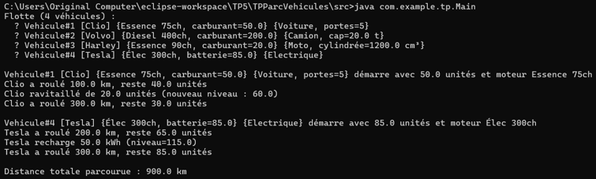

TP 5 : Héritage

Exercice 3 : Parc de véhicules – Héritage, composition et gestion de flotte

Objectif
Modéliser un parc de véhicules en Java avec :

Une hiérarchie de classes multi-niveaux (Vehicule → Motorise → Voiture, Camion, Moto, VoitureElectrique)
Une classe de composition Moteur
La gestion du carburant (ou batterie) sans lever d’exceptions
Une classe Flotte qui stocke dynamiquement les véhicules et calcule des statistiques

