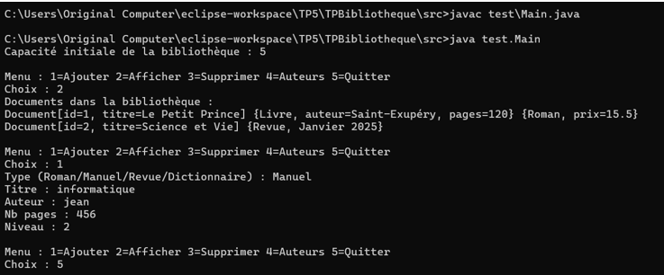

TP 5 : Héritage

Exercice 2 : Héritage et gestion d’un zoo avec tableau dynamique d’animaux

Objectif
Concevoir en Java une hiérarchie de classes pour modéliser un zoo, en appliquant l’héritage (sans abstrait ni interface) et en gérant un tableau d’Animal qui s’agrandit dynamiquement.

